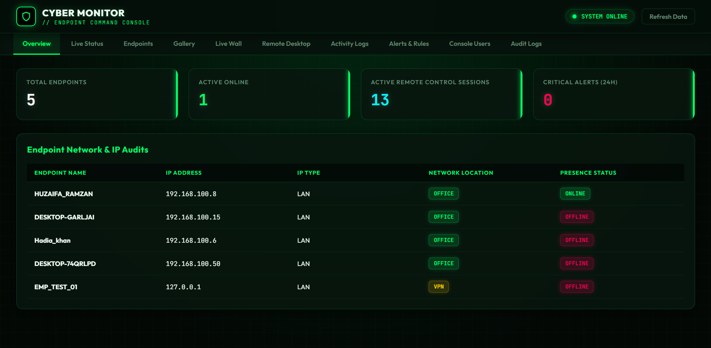
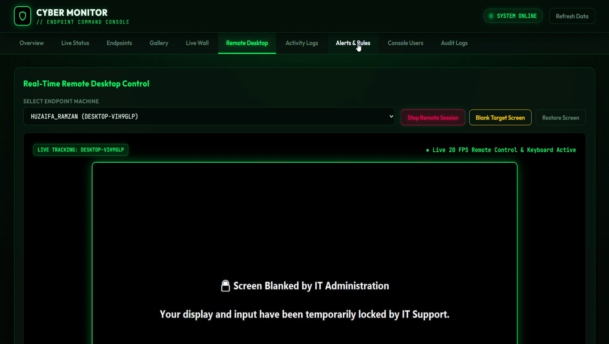
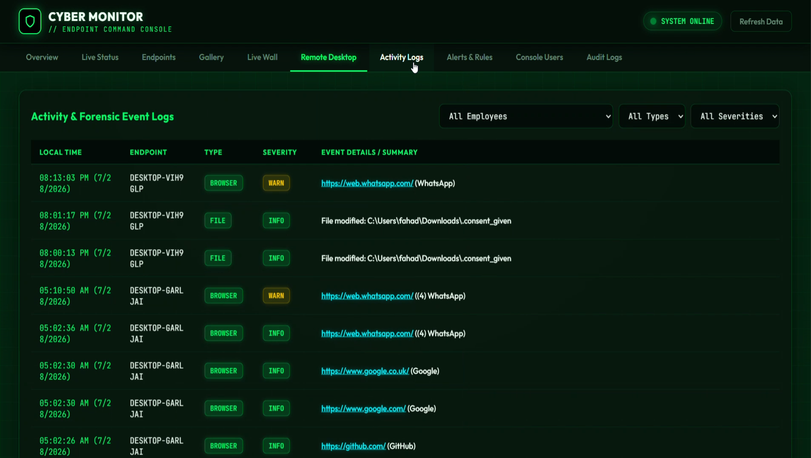
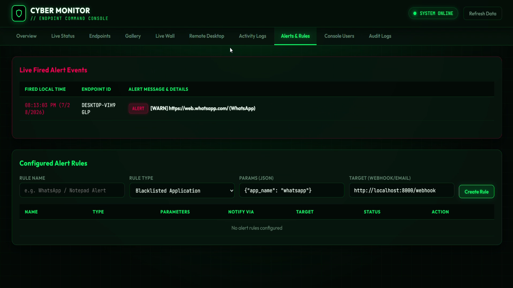
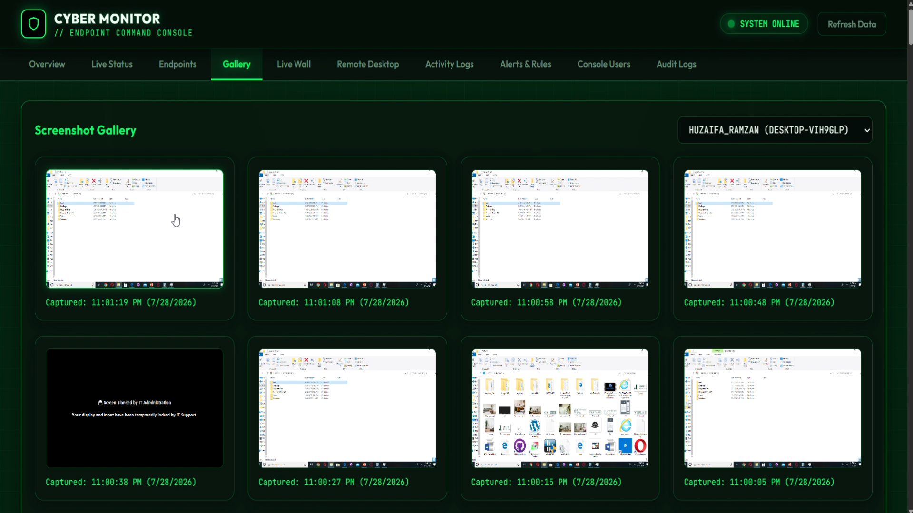
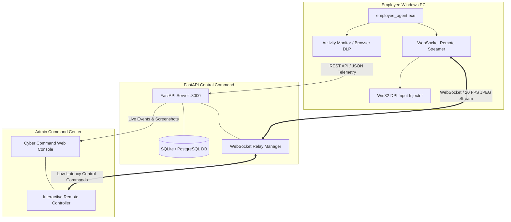

<div align="center">

# 🛡️ CyberSentinel EDR & DLP Platform
### Enterprise Endpoint Detection, Response, Data Loss Prevention & Remote Command Console

[](https://www.python.org/)
[](https://fastapi.tiangolo.com/)
[](https://microsoft.com/windows)
[](backend/main.py)
[](LICENSE)

<p align="center">
  <b>A full-stack, enterprise-grade Endpoint Monitoring & Security solution. Features low-latency 20 FPS remote desktop control, browser DLP URL monitoring, instant messaging risk alerts, interactive screen blanking, and an autonomous single-file executable agent.</b>
</p>

[📽️ Watch System Demo Video](DEMO_VIDEO.mp4) • [🛠️ Read Setup Guide](SETUP_GUIDE.md) • [✨ View Features](#-key-features--capabilities)

---

### 🖥️ Command Console Preview

*Central Command Dashboard displaying active endpoint status, real-time statistics, IP network audits, and system health.*

</div>

---

## 📸 System Showcase & Visual Walkthrough

<div align="center">

| Feature Module | Visual Preview |
| :--- | :--- |
| **⚡ Interactive Remote Desktop Control & Screen Blanking**<br><br>Features low-latency 20 FPS WebSocket streaming, Win32 DPI-aware mouse & keyboard injection, and one-click remote screen locking with an IT support overlay. |  |
| **🛡️ Multi-Profile Browser DLP & Web WhatsApp Alerts**<br><br>Audits Chromium and Edge profiles in real-time. Automatically flags activity on web messaging channels (WhatsApp, Telegram, Discord) with high-priority warnings. |  |
| **🚨 Live Alert Rules & Automation Engine**<br><br>Configurable blacklisted application and keyword triggers with instant real-time alerting and webhook distribution. |  |
| **🖼️ Screenshot Timeline & Evidence Vault**<br><br>Historical activity capture gallery with automated screenshot frequency elevation during active communication app usage. |  |

</div>

---

## 🌟 Key Features & Capabilities

### ⚡ 1. Interactive Remote Desktop & Input Injection
* **High-FPS Screen Streaming**: Real-time 20 FPS video feed delivered over WebSockets using optimized JPEG compression.
* **DPI-Aware Coordinate Injection**: Win32 API normalized absolute coordinate dispatching (`0x8001`), ensuring pixel-perfect remote cursor placement across multi-display and scaled high-DPI monitors.
* **Emergency Screen Blanking**: One-click screen masking ("Black Screen by IT Administration") with complete input freeze for emergency security intervention.

### 🛡️ 2. Multi-Profile DLP & Messaging Telemetry
* **Omni-Browser Audit Engine**: Continuously scans Chrome, Edge, and derivative Chromium user profiles (`Default`, `Profile 1`, etc.) for active tabs, URLs, and file transfers.
* **Instant Messaging Threat Detection**: Detects access to unauthorized web messaging apps (`web.whatsapp.com`, `telegram.org`, `discord.com`).
* **Adaptive Screenshot Boosting**: Dynamically boosts screenshot capture frequency down to 3-second intervals when high-risk messaging windows gain focus.

### 🖥️ 3. Cyber Command Web Console
* **Futuristic Dark-Mode Cyber Aesthetic**: Modern glassmorphic interface styled with custom CSS (`#030805`), glowing neon accents (`#00ff66`), Google Fonts (`Outfit`, `JetBrains Mono`), and matrix scanline accents.
* **Live View Grid**: Multi-endpoint live video matrix with automatic **`SIGNAL LOST // OFFLINE`** placeholder fallback when agents disconnect.
* **Forensic Audit Logs**: Centralized, searchable repository for browser activity, system events, screenshots, and alert triggers.

### 📦 4. Autonomous Windows Executable Agent
* **Single-Binary Distribution**: Standalone 1-file executable (`employee_agent.exe`) generated via PyInstaller with zero target-machine Python dependencies.
* **Dynamic IP Discovery**: Auto-detects server connection and presents a clean GUI dialog for IT server IP configuration if network topology changes.
* **Consent & Compliance**: Enforces explicit employee consent logging prior to telemetry initialization.

---

## 📐 Architecture & System Flow



---

## 🛠️ Technology Stack

| Component | Stack & Tools | Key Responsibilities |
| :--- | :--- | :--- |
| **Backend Core** | `Python 3.11+`, `FastAPI`, `Uvicorn`, `SQLAlchemy` | REST endpoints, WebSocket relays, database management, alert dispatches |
| **Agent Binary** | `PyInstaller`, `ctypes` (Win32 API), `mss`, `Pillow`, `websockets` | 20 FPS desktop capture, DPI coordinate injection, browser DLP scanning |
| **Web Console** | `HTML5`, `Vanilla JavaScript`, `Custom Glassmorphism CSS` | Cyber dashboard UI, multi-endpoint grid, remote desktop viewer |
| **Database** | `SQLite` / `PostgreSQL` | Endpoint registration, audit telemetry logs, screenshot metadata, alert rules |

---

## 📁 Repository Structure

```
Enterprise-Endpoint-Monitoring-System/
├── 1.png                     # Dashboard Overview Showcase Screenshot
├── 2.png                     # Screenshot Gallery Showcase Screenshot
├── 3.png                     # Remote Desktop Control Showcase Screenshot
├── 4.png                     # Forensic Activity Logs Showcase Screenshot
├── 5.png                     # Alerts & Rules Engine Showcase Screenshot
├── DEMO_VIDEO.mp4            # Full System Demonstration Video
├── README.md                 # System Overview & Visual Documentation
├── SETUP_GUIDE.md            # IT Deployment & Build Instructions
├── agent/
│   ├── agent.py              # Agent lifecycle, heartbeat & screenshot engine
│   ├── activity_monitor.py   # Multi-profile browser DLP & WhatsApp scanner
│   ├── remote_control.py     # Win32 DPI input injector & 20 FPS streamer
│   ├── config.json           # Agent network & telemetry configuration
│   └── dist/
│       └── employee_agent.exe# Compiled standalone Windows binary
└── backend/
    ├── main.py               # FastAPI server & Cyber Command Web UI
    ├── models.py             # Database ORM data models
    ├── ws.py                 # Real-time WebSocket stream relay manager
    └── static/               # System assets & static web files
```

---

## 🚀 Quickstart & Installation

> 📌 **Detailed Guide**: For step-by-step IT distribution, firewall setup, and PyInstaller binary compilation, consult the [**SETUP_GUIDE.md**](SETUP_GUIDE.md).

### 1. Launch Central Command Server
```bash
cd backend
pip install -r requirements.txt
python -m uvicorn main:app --host 0.0.0.0 --port 8000
```
> Access Central Command Console at **`http://localhost:8000`**

### 2. Run Employee Agent
```bash
# Option A: Run directly via Python
cd agent
pip install -r requirements.txt
python agent.py

# Option B: Run Standalone Executable
.\agent\dist\employee_agent.exe
```

---

## 📜 Compliance, Ethics & License

* **Enterprise Ethics**: This software is designed for enterprise asset security, IT remote support, and corporate Data Loss Prevention (DLP).
* **Consent & Governance**: Employee notification and legal consent mechanisms are embedded into the deployment workflow.
* **License**: Distributed under the [MIT License](LICENSE).

