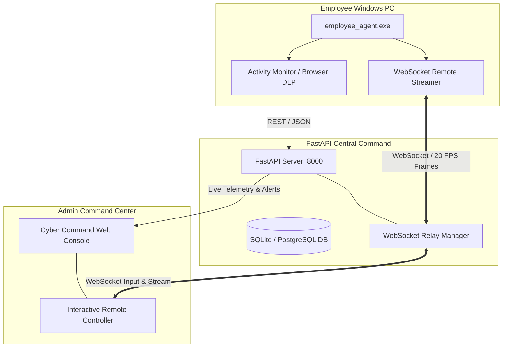

# 🛡️ CyberSentinel Endpoint Monitor & DLP Platform

[](https://www.python.org/)
[](https://fastapi.tiangolo.com/)
[](https://microsoft.com/windows)
[](LICENSE)

> **Enterprise Endpoint Detection & Response (EDR), Data Loss Prevention (DLP) & Interactive Remote Desktop Command Platform**

---

## 📽️ System Demo Video

https://user-images.githubusercontent.com/DEMO_VIDEO.mp4

> 💡 **Watch `DEMO_VIDEO.mp4`** — *Demonstrates real-time endpoint activity tracking, Web WhatsApp alert triggers, and live 20 FPS remote desktop control.*

[📹 Download / Play Local DEMO_VIDEO.mp4](DEMO_VIDEO.mp4)

---

## 🌟 Key Features & Capabilities

### 1. ⚡ Real-Time Remote Desktop Stream & Keyboard/Mouse Control
* **Low-Latency 20 FPS Desktop Video**: High-frame-rate WebSocket streaming using lightweight JPEG frame encoding.
* **DPI-Aware Windows Input Injection**: Accurate mouse tracking and click dispatch using normalized Win32 absolute coordinate mapping (`0x8001`).
* **Remote Screen Blanking**: One-click screen blanking (Black Screen overlay) with low-level Win32 input lock for sensitive support operations.

### 2. 🛡️ Multi-Profile Browser DLP & Web WhatsApp Alerts
* **Chromium & Edge Profile Auditing**: Scans all local browser profiles (`Default`, `Profile 1`, etc.) for newly opened URLs and history events.
* **Instant Messaging Alerting**: Automatically flags sessions on communication channels (`web.whatsapp.com`, `telegram.org`, `discord.com`) with `warn` severity.
* **Screenshot Boost**: Automatically elevates screenshot frequency to 3-second intervals when messaging apps gain active window focus.

### 3. 🖥️ Cyber Command Web Console
* **Glassmorphic Cyber UI**: Built with modern dark-mode aesthetic (`#030805`), glowing neon accents (`#00ff66`), Google Fonts (`Outfit` & `JetBrains Mono`), and matrix scanlines.
* **Live View Wall**: Real-time multi-endpoint grid displaying active screen feeds and automatic **`SIGNAL LOST // OFFLINE`** black screen placeholders for disconnected endpoints.
* **Local Time Telemetry**: Localized timestamp conversion across all event logs, screenshots, and alert rule events.

### 4. 📦 Autonomous Standalone Executable Agent
* **Single Binaries (`employee_agent.exe`)**: Compiled into a zero-dependency 1-file executable using PyInstaller.
* **Interactive IP Fallback**: Auto-detects server connection and prompts IT administrators with a GUI input dialog if the backend IP changes.
* **Idempotent Consent Logging**: Ensures compliance by validating employee consent before initializing telemetry recording.

---

## 📐 Architecture Overview



---

## 🚀 Quickstart & Installation

For full deployment instructions, see the dedicated [**SETUP_GUIDE.md**](SETUP_GUIDE.md).

### 1. Start Central Command Backend
```bash
cd backend
pip install -r requirements.txt
python -m uvicorn main:app --host 0.0.0.0 --port 8000
```
> Access Central Console at **`http://localhost:8000`** (or `http://YOUR_SERVER_IP:8000`).

### 2. Deploy Employee Agent
```bash
# Option A: Run directly via Python
cd agent
pip install -r requirements.txt
python agent.py

# Option B: Run Standalone Windows Executable
.\agent\dist\employee_agent.exe
```

---

## 🛠️ Technology Stack

* **Backend Engine**: Python 3.11+, FastAPI, Uvicorn, SQLAlchemy, SQLite/PostgreSQL, WebSockets.
* **Agent Executable**: PyInstaller, Win32 API (`ctypes`), `mss` Screen Grabber, `Pillow`, `requests`, `websockets`.
* **Frontend Web Console**: HTML5, Vanilla JavaScript, Custom Glassmorphism CSS, Google Fonts (`Outfit`, `JetBrains Mono`).

---

## 📁 Repository Structure

```
.
├── agent/
│   ├── agent.py               # Main agent lifecycle & screenshot loop
│   ├── activity_monitor.py    # Multi-profile browser DLP & WhatsApp scanner
│   ├── remote_control.py      # Win32 DPI-aware input injector & 20 FPS streamer
│   └── dist/
│       └── employee_agent.exe # Standalone Windows executable
├── backend/
│   ├── main.py                # FastAPI endpoints & Cyber Web UI
│   ├── models.py              # Database ORM schemas
│   └── ws.py                  # Real-time WebSocket relay manager
├── README.md                  # System Documentation
└── SETUP_GUIDE.md             # Step-by-step IT Deployment Guide
```

---

## 📜 License & Compliance

This software is built for internal enterprise endpoint monitoring, IT support, and data loss prevention. Telemetry collection requires explicit employee consent prior to activation. Distributed under the **MIT License**.
